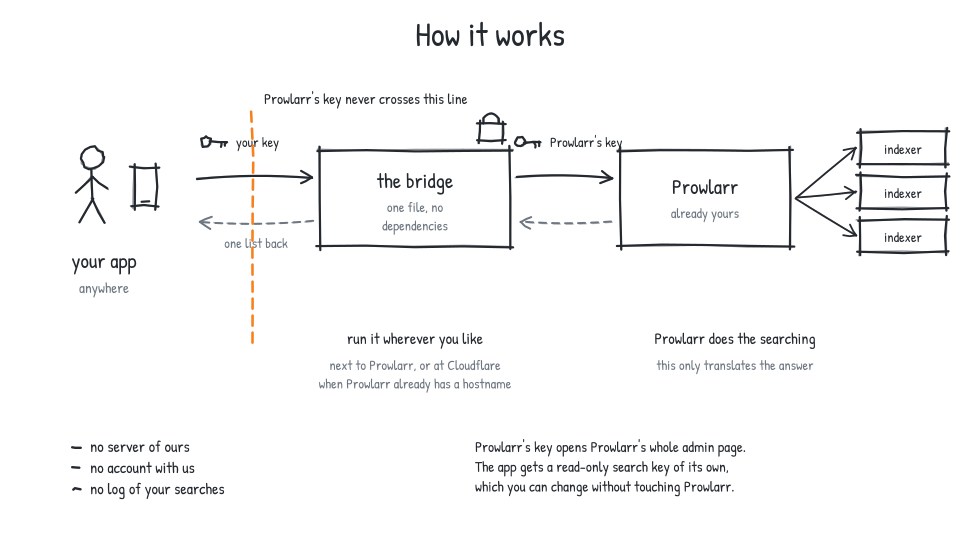

# Prowlarr bridge

Search your own Prowlarr from an app, without giving that app Prowlarr's key.

Prowlarr already searches your indexers and merges the answers. It speaks its
own API, which streaming clients do not. This translates one to the other: your
app asks it for a search, it asks Prowlarr, and it hands back an ordinary JSON
list of names, sizes, seeders and `magnet:` links.

One file, no dependencies, and short enough to read in a sitting.



**Why not point the app straight at Prowlarr?** Two reasons. Prowlarr's API key
opens Prowlarr's whole admin interface, so anything holding it can add
indexers, read your other keys, and change your settings. And Prowlarr's search
takes different parameter names, applies `limit` per indexer rather than per
answer, and returns releases in a shape no client reads. This fixes both: your
app gets a key of its own that only searches, and an answer it understands.

## Set it up in your browser

If your Prowlarr already has a public URL, this is the whole job: paste that URL
and Prowlarr's key, press a button, and Cloudflare hosts the bridge for you.
Free, no card, nothing installed, and it works on a phone.

[](https://momzv2022-ctrl.github.io/prowlarr-bridge/)

Five short steps: your Prowlarr details, sign in to Cloudflare, press Deploy,
open your new bridge and press Finish setup, and your URL and key are shown
together with a button that tests them.

Everything you type stays in your browser. Prowlarr's key is written into your
copy of the file and travels inside the deploy link, after the `#`, which
browsers never send to a server. It is not saved in your browser, and the page
makes no network request at all. **Do not forward that deploy link to anyone**,
and if you would rather the key never sat in a link, the page has a route that
adds it in the Cloudflare dashboard instead.

You need Prowlarr's API key: it is in Prowlarr under *Settings*, *General*,
*Security*.

## Or run it yourself

Pick by where Prowlarr is.

| | |
|---|---|
| **Prowlarr is on your own machine or LAN** | Run the bridge next to it. Recipe A. |
| **Prowlarr already has a public URL** | Deploy it to Cloudflare. Recipe B, or the button above. |

A Cloudflare Worker cannot reach a machine on your home network, so recipe B
and the button both need Prowlarr itself reachable from the internet. If it is
not, prefer recipe A and expose the bridge instead: it is a few hundred lines
that only search, rather than Prowlarr's whole admin interface.

### Recipe A: next to Prowlarr

Needs Node 20 or newer, which is the only thing it needs.

```sh
curl -fsSLO https://raw.githubusercontent.com/momzv2022-ctrl/prowlarr-bridge/main/worker/src/worker.js
BRIDGE_API_KEY=$(openssl rand -hex 16) \
PROWLARR_URL=http://127.0.0.1:9696 \
PROWLARR_APIKEY=your-prowlarr-key \
node worker.js
```

It prints the URL it is serving on and the key it will accept. Point your app at
both. `http://127.0.0.1:9696` is Prowlarr's default; if Prowlarr is on another
machine, use its URL.

To reach it from outside the house, put a Cloudflare Tunnel in front of the
bridge, not in front of Prowlarr. Prowlarr then never leaves the machine.

To keep it running, use whatever already runs things on that machine. A systemd
unit:

```ini
[Service]
Environment=BRIDGE_API_KEY=your-bridge-key
Environment=PROWLARR_URL=http://127.0.0.1:9696
Environment=PROWLARR_APIKEY=your-prowlarr-key
ExecStart=/usr/bin/node /opt/prowlarr-bridge/worker.js
Restart=always
```

### Recipe B: at Cloudflare

Free, and the URL stays up when your machine sleeps. Prowlarr has to be
reachable from the internet for this to work at all.

```sh
curl -fsSLO https://raw.githubusercontent.com/momzv2022-ctrl/prowlarr-bridge/main/worker/src/worker.js
npx wrangler deploy worker.js --name prowlarr-bridge --compatibility-date 2026-08-21
npx wrangler secret put BRIDGE_API_KEY
npx wrangler secret put PROWLARR_URL
npx wrangler secret put PROWLARR_APIKEY
```

`wrangler` opens your browser once to sign in, then prints your URL. Put all
three in as secrets rather than variables: two of them are keys, and the third
is a hostname you would rather not have in a dashboard others can read.

Cloudflare's free plan covers 100,000 requests a day and needs no card.

## Settings

Only the first three are required.

| | |
|---|---|
| `BRIDGE_API_KEY` | What your app sends here, as `X-API-Key`. At least 16 characters, or the bridge refuses to serve. |
| `PROWLARR_URL` | Prowlarr's base URL, for example `http://127.0.0.1:9696`. A trailing `/api/v1` is trimmed off. |
| `PROWLARR_APIKEY` | Prowlarr's own key. Never sent to a client. |
| `PROWLARR_INDEXER_IDS` | Which indexers to ask, by id, comma separated. Empty means every enabled one. |
| `BRIDGE_PORT` | Node only. Default `8788`. |
| `BRIDGE_HOST` | Node only. Default `127.0.0.1`. Set `0.0.0.0` to accept from the LAN. |
| `BRIDGE_TIMEOUT_S` | How long to wait for Prowlarr. Default `45`. |
| `BRIDGE_MAX_ROWS` | Most rows to ask each indexer for. Default `100`. Raise it only if you have one indexer and page deep. |
| `BRIDGE_BROWSE_ROWS` | Rows per indexer for a search with no words in it. Default `25`. Set `0` to answer those instantly without asking Prowlarr. |
| `BRIDGE_MAX_RESOLVE` | Most rows per page whose `.torrent` may be read from Prowlarr. Default `12`. This is what makes private trackers work; `0` turns it off and drops their rows as before. |
| `BRIDGE_TORRENTFILE_TTL_S` | How long a `torrent_url` stays valid. Default `3600`. |
| `BRIDGE_CORS_ORIGINS` | Web pages allowed to call this, comma separated. Empty means none. |
| `BRIDGE_ALLOW_ANONYMOUS` | Serve with no key at all. On a public URL this hands your Prowlarr to anyone who finds it. |

## What your app gets

Three routes, one header, JSON out.

```sh
curl -H "X-API-Key: YOUR-BRIDGE-KEY" \
  "http://127.0.0.1:8788/api/v1/search?q=big+buck+bunny&limit=5"
```

`/api/v1/search` takes `q`, and optionally `cat`, `year`, `res`, `min_seeders`,
`sort`, `limit` and `offset`. It answers with `torrents`, each carrying a
`magnet`, an `infohash`, a name, a size, seeder and leecher counts, and whatever
the release name gives up: year, resolution, codec, source, season, episode.

### Private trackers

A public indexer publishes a magnet, so its rows arrive complete. A private one
does not: the `.torrent` is behind your passkey, so Prowlarr reports the release
with no `magnetUrl` and no `infoHash` — nothing that identifies the content, and
nothing TSP can carry. Those rows used to be dropped, which meant a Prowlarr of
nothing but private indexers answered every search with an empty list.

Now the file is read. For the rows on the page you asked for, the bridge fetches
the `.torrent` from Prowlarr, and takes the infohash from the file itself —
`sha1` of its info dict, so it is the real one rather than a guess. That also
fills in the size and the file count when the indexer did not say.

Each of those rows comes back with a **`torrent_url` pointing at this bridge**,
never at Prowlarr:

```
https://your-bridge.example/api/v1/torrentfile/<infohash>?t=<token>
```

That URL matters more here than anywhere else. A private torrent sets
`private: 1`, which turns off DHT and peer exchange — so the magnet, which TSP
requires on every row and which is still sent, cannot reach the swarm on its
own. The `.torrent` can, because your passkey is in its announce URL. Point your
client at `torrent_url` and it works; the magnet is there for the rows where it
is enough.

The token is **sealed, not signed**: AES-GCM under your own `BRIDGE_API_KEY`, so
what your app holds is an opaque string it cannot read. Prowlarr's address and
Prowlarr's key stay on the server, which is the point of the whole bridge. The
route still requires your key, refuses a token it did not mint, refuses one that
has expired, refuses one aimed at any origin but Prowlarr's, and refuses a file
whose infohash is not the one in the URL.

If you would rather none of this happened, `BRIDGE_MAX_RESOLVE=0` restores the
old behaviour exactly: no extra requests, no `torrent_url`, no route, and rows
without a magnet dropped.

### If you want Sonarr, Radarr or anything else that speaks Torznab

**You do not need this.** Prowlarr is already a Torznab source, and it has
built-in support for handing your indexers to Sonarr, Radarr, Lidarr and
Readarr directly. Add them under *Settings*, *Apps* in Prowlarr and it syncs
your indexers across on its own. Putting this bridge in the middle would add a
hop and take features away.

This bridge is for the other case: a client that speaks plain JSON and does not
speak Torznab, and that you would rather not hand Prowlarr's key to.

`/healthz` needs no key and reports configuration only, so it makes no request
of its own. `/healthz?probe=1` needs the key and asks Prowlarr: whether it
answers, whether it accepts the key, how many torrent indexers are enabled, and
which of them Prowlarr has currently blocked.

That last one matters more than it sounds. **When every indexer fails, Prowlarr
logs the failures and returns an empty list**, so an outage and a genuine nil
return are the same reply. `?probe=1` is where the difference shows.

The answer is the same shape the
[Unified Torrent Search Interface](https://github.com/momzv2022-ctrl/unified-torrent-search-interface)
produces, down to the tracker list in a synthesised magnet, so an app can hold
results from both without seeing two of everything.

## Check it before you trust it

- **It is one file.** [`worker/src/worker.js`](worker/src/worker.js). No
  dependencies, no build step, no minifier. What you run is what you read.
- **Search it for `fetch(`.** There is one, and it goes to `PROWLARR_URL`.
  Nothing else is contacted, ever, and there is no telemetry.
- **Prowlarr's key goes into one header, on requests to Prowlarr.** Never into a
  query string, where it would land in access logs, and never into an answer.
  A test asserts that no response body ever contains it or Prowlarr's hostname.
- **Your app's key is compared in constant time**, so it cannot be guessed one
  character at a time.
- **The published file is this file.** A public GitHub Actions run copies it to
  the setup page and prints its SHA-256, which the page shows and
  [`worker.js.sha256`](https://momzv2022-ctrl.github.io/prowlarr-bridge/worker.js.sha256)
  publishes. Download it and run `shasum -a 256 worker.js`.
- **The setup page fetches nothing.** It mints your key with
  `crypto.getRandomValues`, writes all three settings into your copy of the
  file, and never makes a request. A browser check opens it at five screen
  sizes on every push and fails the build if it ever reaches the network.
- **The tests run offline**, on Node 20 and 22, on every push. Prowlarr is a
  table of recorded releases, and the whole answer is frozen in
  [`worker/tests/golden/search.json`](worker/tests/golden/search.json), so any
  change to what a client receives shows up as a diff a person has to approve.

```sh
npm test
```

## What it does not do

- **It does not fetch a `.torrent` for a row nobody looked at.** Only rows on
  the page being answered are resolved, up to `BRIDGE_MAX_RESOLVE`. Rows past
  that come back counted as `unresolved` rather than silently missing. A release
  with no magnet, no infohash *and* no download URL was never a candidate at all,
  and is still counted as `dropped_without_magnet`.
- **`cat=image` and `cat=archive` are best effort.** Prowlarr categorises by
  Newznab id, which has no image and no archive category, so those two searches
  go out unfiltered and are narrowed by reading release names. The other four
  are filtered by Prowlarr itself.
- **`/api/v1/stats` is deliberately absent.** A client that cannot read it
  offers every category, which is the right answer for something with no
  catalogue of its own to count.
- **It searches nothing itself.** Coverage, indexer health and rate limits are
  Prowlarr's, and so is anything that goes wrong with them.

If searches are slow, the cause is almost always upstream of here. Prowlarr
asks every enabled indexer and waits for the slowest, and an empty search is
the most expensive request of the lot because every indexer browses its whole
front page. `BRIDGE_BROWSE_ROWS=0` removes that one entirely.
`PROWLARR_INDEXER_IDS` narrows the fan-out to the indexers you actually want,
and `/healthz?probe=1` names the ones Prowlarr has currently blocked. A
`trycloudflare.com` quick tunnel is also worth ruling out: Cloudflare supports
those for testing only, with no uptime guarantee and a cap on concurrent
requests.

## Privacy

It **keeps no log**. Nothing is written anywhere: there is no database, no file
and no state between requests.

It is not anonymity. Your indexers see the query, Prowlarr sees it, and on the
Cloudflare path Cloudflare carries it. What it does do is keep Prowlarr's key,
and Prowlarr's URL, on the server side of the line.

There is **no public instance of this and no list of other people's**. The only
one that exists is the one you run.

One thing to know about private trackers: a magnet built from one of their
`.torrent` files carries that file's announce URL, and **your passkey is in it**.
That is what makes it work in your own client, and it is also why a magnet from a
private row is not a thing to paste anywhere. It identifies your account. The
same is true of the `.torrent` itself, which is why the route that serves it
wants your key.

## Your responsibility

This searches indexers you configured in software you run. Laws about what you
may download differ from country to country, and so do the terms of the sites
Prowlarr queries. Complying with both is yours to do. Nothing here is legal
advice.

MIT licence, and it is provided **without warranty of any kind**, with the
authors **not liable** for any claim or damages arising from it or from its use.
